# 01: Lab Setup

## Objective
To set up virtual machines that wil be useful for this home lab

## Environment
- Host machine: [HP Elitebook Folio 1040 G3, 8GB RAM, core i5]
- VMs: Ubuntu Server (version 24.04.5), Windows 10, Kali Linux
- Network setup: [NAT]

## Steps
1. First, I downloaded the Ubuntu server [version 24.04.5.1] at  https://ubuntu.com/download/server
2. Next, I created a new virtual machine in my VMware and installed the downloaded Ubuntu server.

3. | Hostname | OS | IP | MAC | Role | Network Adapter Type | Default gateway | DNS |
   | --- | --- | --- | --- | --- | --- | --- | --- |
   | Ubuntu 64-bit | Ubuntu 24.04.5 LTS | 192.168.253.129/24 | 00:0c:29:19:e0:85 | SIEM | NAT | 192.168.253.2 | 192.168.253.2 |

4. Then https://www.microsoft.com/en-us/software-download/windows10 to create the installation media to download the windows 10 iso image
5. Next, I created another virtual machine and installed the windows 10 iso on it.

      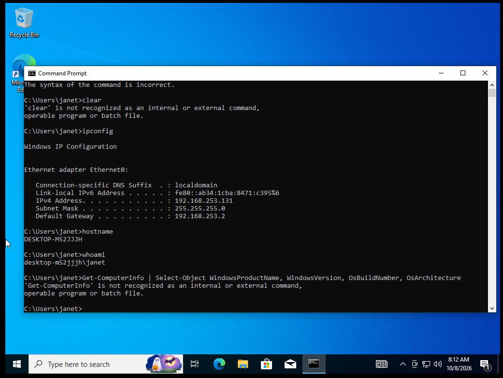
   
6. | Hostname | OS | IP | MAC | Role | Network Adapter Type | Default gateway | DNS |
   | --- | --- | --- | --- | --- | --- | --- | --- |
   | DESKTOP-M52JJJH | Windows 10 pro | 192.168.253.131 | 00:0c:29:19:e0:85 | Endpoint | NAT | 192.168.253.2 | 192.168.253.2 |

   Running  Processes on my WIndows machine 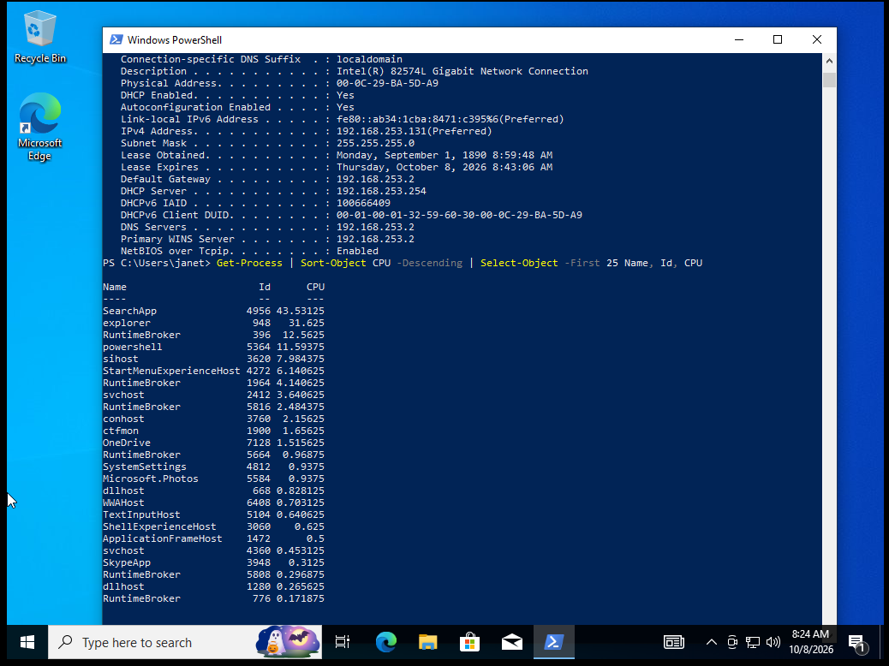

   | Name/PID | What it Does | Why It Matters | Expected | Suspicious If |
   | --- | --- | ---| ---| --- |
   | Explorer.exe / PID 948 | It is the windows shell | It runs as my user, so it inherits permissions | Yes, normally one instance | It runs from another foldeer or a second copy appears unexpectedly |
   | svchost.exe / PID 2412,4360 | Shared host that runs many windows services | there are many copies so malware can hide itself by naming itself svchost.exe | Yes, many instances | The path is outside System32, the parent isn't services.exe or making unusual network connections |
   | Powershell.exe / PID 5364 | command shell | Most SOC detections for it focus on how it was launched | Yes, because I opened it myself | it runs when no user is logged in |
   | conhost.exe / PID 3760 | Draws console window for command-line programs | every command-line session gets one | Yes, it belongs to my powershell window | it exists with no matching console program |
   | RuntimrBroker.exe / PID 396,1964, | manages permission checks between microsoft apps and the system | it sits between apps so its name is easy to fake | Yes, several instances | the path is outside System32, the spelling is subtly different or it keeps using high CPU. 

   Running Services 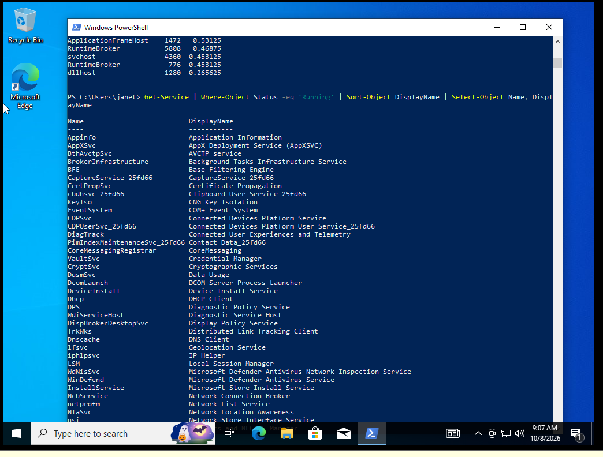

   Listening ports 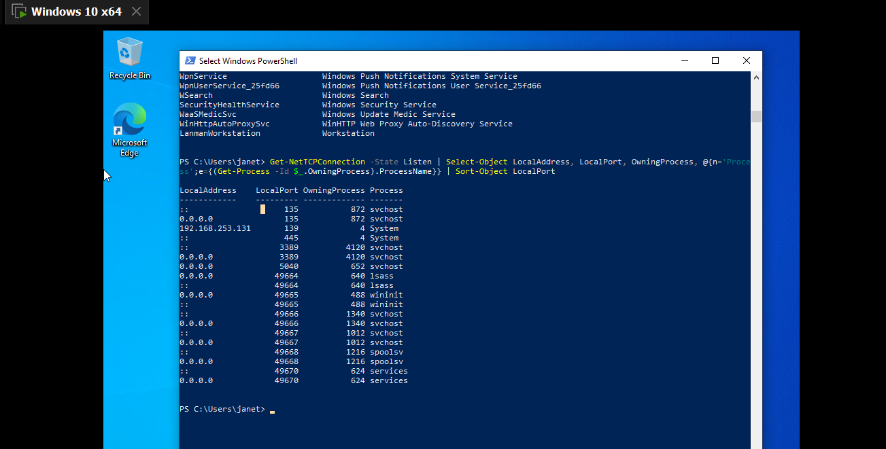

   Active Connections 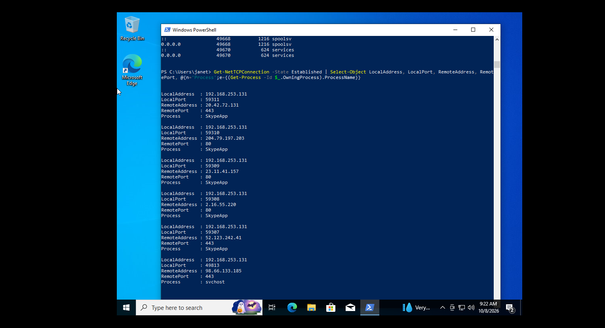

   Firewall Status 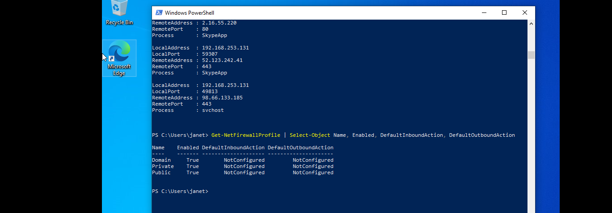

   Log evidence 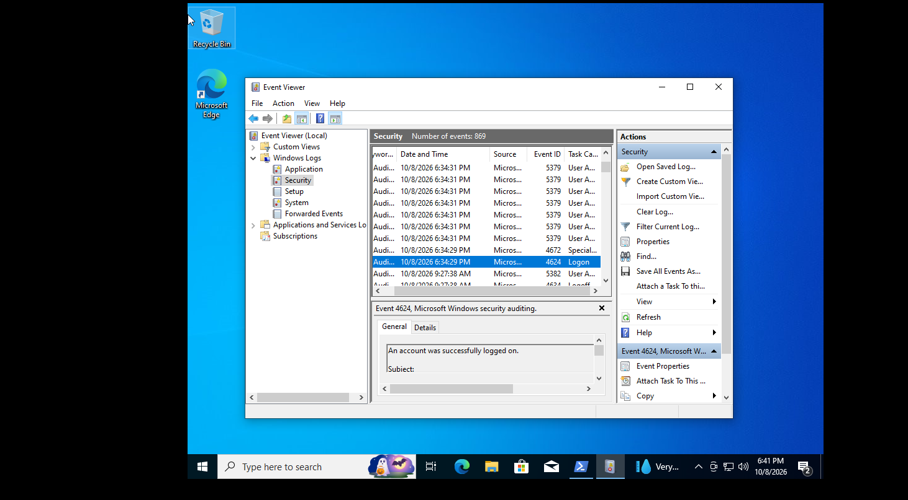
   
7. Next, I created another virtual machine for Kali Linux
  
8. | Hostname | OS | IP | MAC | Role | Network Adapter Type | Default gateway | DNS |
   | --- | --- | --- | --- | --- | --- | --- | --- |
   | Kali | Kali GNU/Linux 2025.4 | 192.168.253.128/24 | 00:0c:29:15:a1:b7 |Security Testing | NAT | 192.168.253.2 | 192.168.253.2 |

9. Created at least two users and one group; added and removed a user from the group
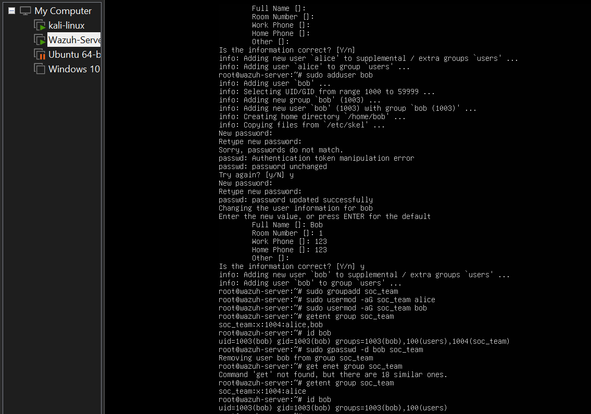

10. Created a test file/directory. Allow one user, restrict another, change ownership and modes, test access
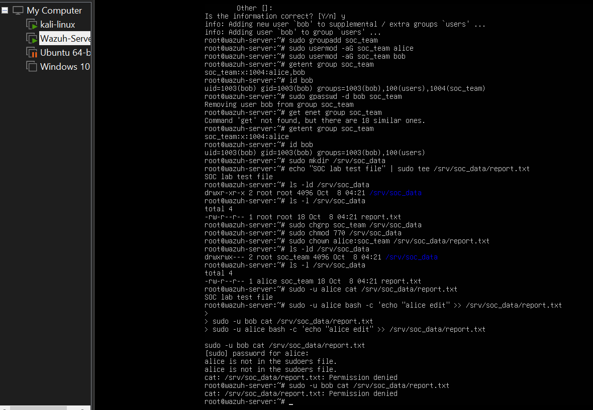

11. Who can access it, with what permissions, and why.

| Item | Mode | Owner/group | Who can do what | Why |
| --- | --- | --- | --- | --- |
| /srv/soc_data | 770 | root / soc_team | root and soc_team members can list, enter and create files. Others get nothing. | Owner and group get rwx, others get ---. A user needs x on a directory to enter it. |
| report.txt |	640 | alice / soc_team | alice can read and write. Group members can only read. Others get nothing. | Owner rw-, group r--, others ---. |
| bob (not in group) |  |  | Blocked at the directory | bob falls under "others", which has no permissions. |
| bob (in group) |  |  | Can read the file, cannot write | The group has read-only access on the file. |

12. normal logins 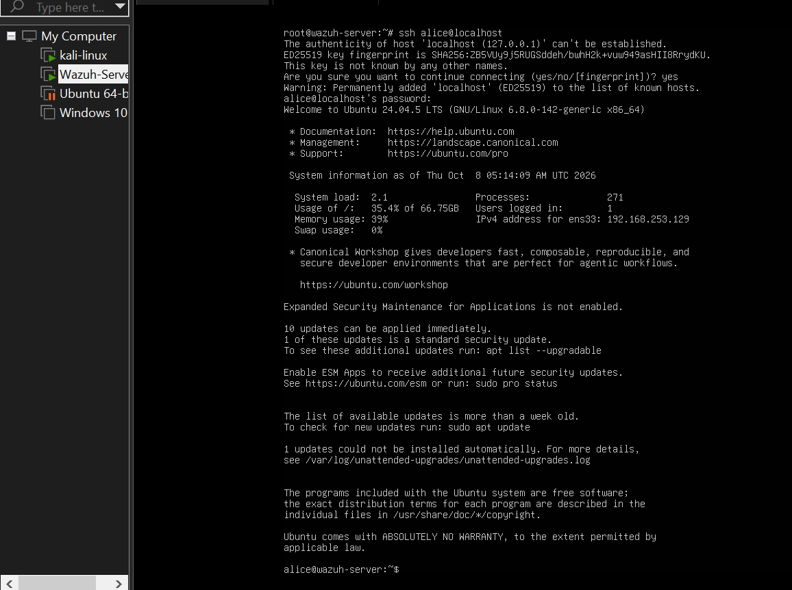
13. I ran a few controlled failed logins against my own lab. 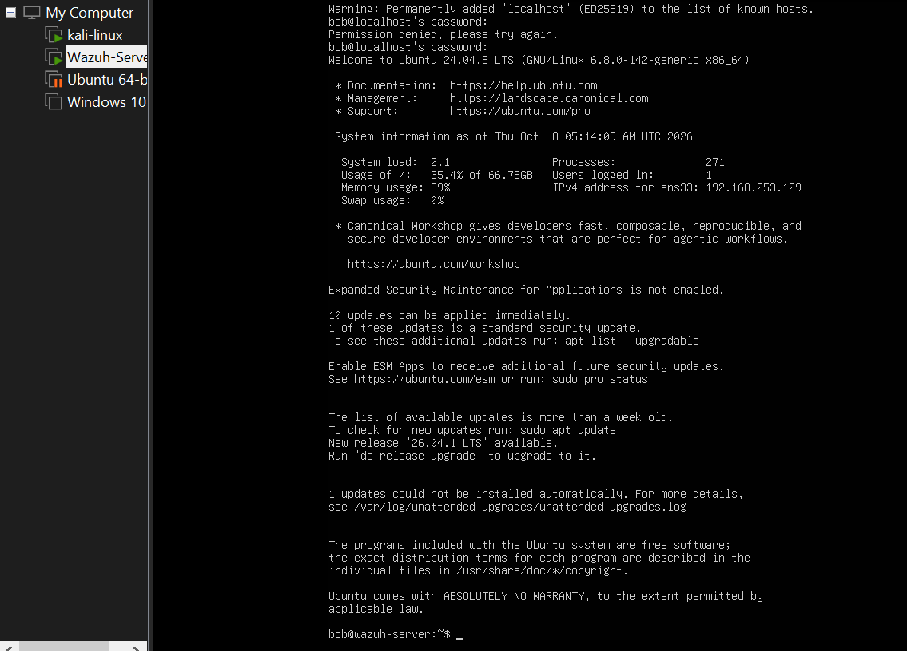
14. Then I checked the evidence in the logs 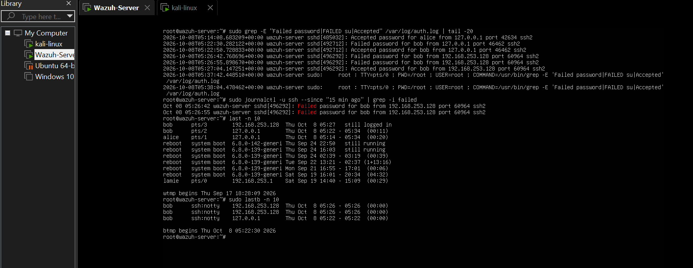

## Results
Successfully installed 3 VMs [Ubuntu Server, Windows 10 and Kali Linux]
Established a connection between all 3 VMs
Performed normal logins and failed logins and checked the evidence in the logs
