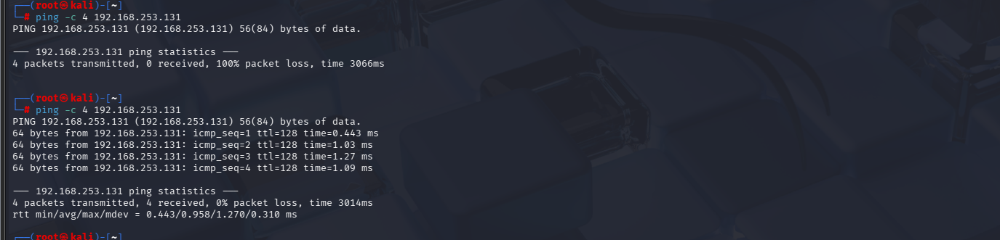
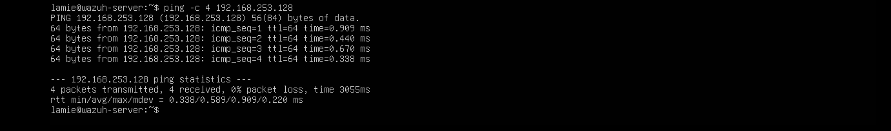
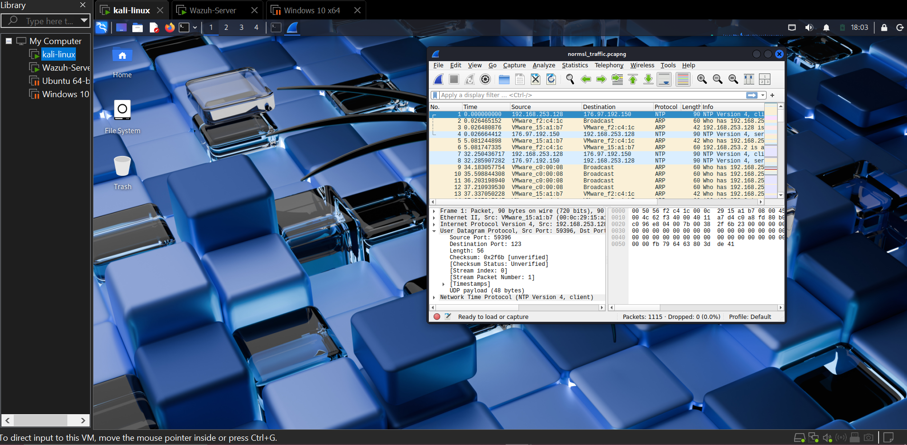
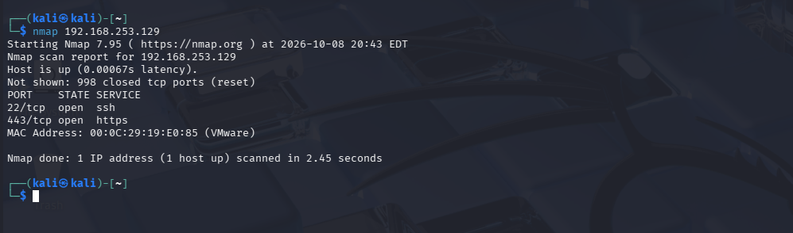
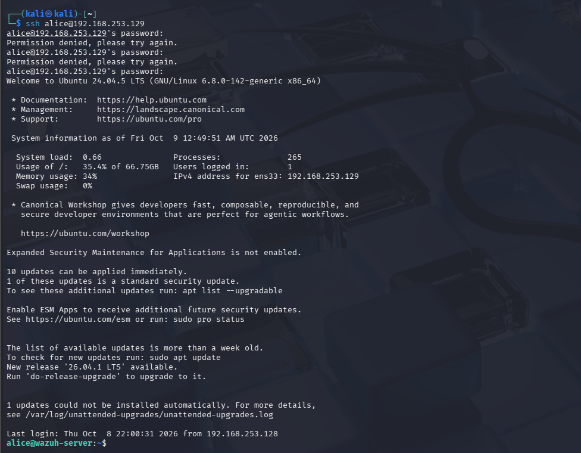
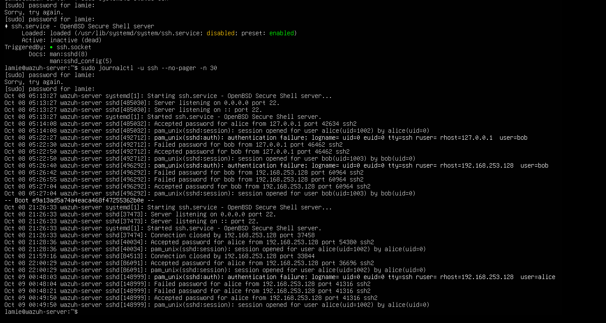

# 01: Lab Setup

## Objective
To build, baseline and investigate a small IT environment

## Environment
- Host machine: Windows 10 [HP Elitebook Folio 1040 G3, 8GB RAM, core i5]
- VMs: Ubuntu Server (version 24.04.5), Windows 10, Kali Linux
- Network setup: [NAT]

## Steps
1. First, I downloaded the Ubuntu server [version 24.04.5.1] at  https://ubuntu.com/download/server

2. Next, I created a new virtual machine in my VMware and installed the downloaded Ubuntu server.

| Hostname | OS | IP | MAC | Role | Network Adapter Type | Default gateway | DNS |
| --- | --- | --- | --- | --- | --- | --- | --- |
| Ubuntu 64-bit | Ubuntu 24.04.5 LTS | 192.168.253.129/24 | 00:0c:29:19:e0:85 | SIEM | NAT | 192.168.253.2 | 192.168.253.2 |

3. Then https://www.microsoft.com/en-us/software-download/windows10 to create the installation media to download the windows 10 iso image

4. Next, I created another virtual machine and installed the windows 10 iso on it.
   
| Hostname | OS | IP | MAC | Role | Network Adapter Type | Default gateway | DNS |
| --- | --- | --- | --- | --- | --- | --- | --- |
| DESKTOP-M52JJJH | Windows 10 pro | 192.168.253.131 | 00:0c:29:19:e0:85 | Endpoint | NAT | 192.168.253.2 | 192.168.253.2 |
  

### Running  Processes on my Windows machine

| Name/PID | What it Does | Why It Matters | Expected | Suspicious If |
| --- | --- | ---| ---| --- |
| Explorer.exe / PID 948 | It is the windows shell | It runs as my user, so it inherits permissions | Yes, normally one instance | It runs from another foldeer or a second copy appears unexpectedly |
| svchost.exe / PID 2412,4360 | Shared host that runs many windows services | there are many copies so malware can hide itself by naming itself svchost.exe | Yes, many instances | The path is outside System32, the parent isn't services.exe or making unusual network connections |
| Powershell.exe / PID 5364 | command shell | Most SOC detections for it focus on how it was launched | Yes, because I opened it myself | it runs when no user is logged in |
| conhost.exe / PID 3760 | Draws console window for command-line programs | every command-line session gets one | Yes, it belongs to my powershell window | it exists with no matching console program |
| RuntimrBroker.exe / PID 396,1964, | manages permission checks between microsoft apps and the system | it sits between apps so its name is easy to fake | Yes, several instances | the path is outside System32, the spelling is subtly different or it keeps using high CPU.

### Running Services

- **WinDefend / WdNisSvc:** Microsoft Defender antivirus and its network inspection service. Expected and important; if they stopped, that would be a red flag.
- **Dnscache:** the DNS client that looks up and remembers website addresses.
- **Dhcp:** gets the machine its IP address automatically.
- **BFE (Base Filtering Engine):** the engine underneath the Windows Firewall.

 

### Listening ports

| Port | Process (PID) | What it's for | Notes |
| --- | --- | --- | --- |
| 135 | svchost (872) | Windows RPC, lets Windows components talk to each other | Expected |
| 139 | System (4) | NetBIOS file and printer sharing on the LAN | Bound only to 192.168.253.131 |
| 445 | System (4) | SMB file sharing | Expected, but historically abused (e.g. WannaCry) |
| 3389 | svchost (4120) | Remote Desktop (RDP) | Means Remote Desktop is turned on. Worth noting as a way in if not needed |
| 5040 | svchost (652) | Windows internal service | Expected |
| 49664 | lsass (640) | Dynamic RPC port used by lsass | Expected |
| 49665 | wininit (488) | Dynamic RPC port | Expected |
| 49666, 49667 | svchost (1340, 1012) | Dynamic RPC ports | Expected |
| 49668 | spoolsv (1216) | Print Spooler | Expected, but the spooler has a history of serious vulnerabilities |
| 49670 | services (624) | Dynamic RPC port | Expected |

### Active Connections 

All established connections go out from the endpoint (192.168.253.131) to internet addresses on port 443 (HTTPS) or 80 (HTTP). Five belong to SkypeApp and one to svchost (98.66.133.185:443). These look like normal background traffic from a preinstalled app and Windows services contacting Microsoft and content-delivery servers. No connection came in from another machine.

### Firewall Status 

| Profile | Enabled | Default inbound | Default outbound |
| --- | --- | --- | --- |
| Domain | True | NotConfigured | NotConfigured |
| Private | True | NotConfigured | NotConfigured |
| Public | True | NotConfigured | NotConfigured |

The firewall is on for all three profiles. "NotConfigured" means no custom default was set, so Windows uses its built-in behaviour: block unsolicited inbound traffic, allow outbound.

### Log evidence 

The Security log held 869 events. I found Event ID 4624 (an account successfully logged on), followed immediately by 4672 (special privileges assigned to the new logon, meaning an administrator-level account signed in) and several 5379 events (Credential Manager credentials were read, which normally happens during sign-in).

   
5. Next, I created another virtual machine for Kali Linux
  
| Hostname | OS | IP | MAC | Role | Network Adapter Type | Default gateway | DNS |
| --- | --- | --- | --- | --- | --- | --- | --- |
| Kali | Kali GNU/Linux 2025.4 | 192.168.253.128/24 | 00:0c:29:15:a1:b7 |Security Testing | NAT | 192.168.253.2 | 192.168.253.2 |

6. Created at least two users and one group; added and removed a user from the group

- Users created: alice and bob (sudo adduser), each with a home folder and password
- Group created: soc_team (sudo groupadd soc_team), group ID 1004
- Membership: added both users with sudo usermod -aG soc_team alice and bob. id bob and id alice confirmed both belonged to soc_team (gid 1004)
- Removal: sudo gpasswd -d bob soc_team removed bob, and id bob then showed it was no longer a member of soc_team

7. Created a test file/directory. Allow one user, restrict another, change ownership and modes, test access

- Test directory and file: /srv/soc-data containing report.txt
- Ownership: sudo chown alice:soc_team /srv/soc-data/report.txt (owner alice, group soc_team)
- Permissions: sudo chmod 640 /srv/soc-data/report.txt
- Result of ls -l: -rw-r----- alice soc_team report.txt

**Access test:**

| Item | Mode | Owner/group | Who can do what | Why |
| --- | --- | --- | --- | --- |
| /srv/soc_data | 770 | root / soc_team | root and soc_team members can list, enter and create files. Others get nothing. | Owner and group get rwx, others get ---. A user needs x on a directory to enter it. |
| report.txt |	640 | alice / soc_team | alice can read and write. Group members can only read. Others get nothing. | Owner rw-, group r--, others ---. |
| bob (not in group) |  |  | Blocked at the directory | bob falls under "others", which has no permissions. |
| bob (in group) |  |  | Can read the file, cannot write | The group has read-only access on the file. |

8. normal logins

Successful login: I ran ssh alice@localhost (correct password) which opened a session as alice

9. I ran a few controlled failed logins against my own lab.

Failed login: ssh bob@localhost with a wrong password returned "Permission denied, please try again"
Then I entered the correct password which opened a session for bob

10. Then I checked the evidence in the logs 

Log investigation: sudo journalctl --since "15 min ago" | grep -i "failed" returned the recorded authentication-failure entries. I also confirmed all logins with sudo grep -E "Failed password|FAILED su|Accepted session" /var/log/auth.log, which showed all entries of failed and accepted passwords for both users.

## Results

Successfully installed 3 VMs [Ubuntu Server, Windows 10 and Kali Linux]

Established a connection between all 3 VMs

### Network Baseline (Wireshark)

Wireshark is a network packet analyzer used to capture and inspect real-time traffic passing through a network interface. I ran Wireshark on my Kali testing machine (192.168.253.128) and opened another terminal in my Kali machine then sshed into my ubuntu sever using the Kali and Ubuntu server as the client and server for the traffic. I captured normal traffic(ping, DNS lookup, web/HTTPS, a TCP connection, SSH to ubuntu machine)

 

According to the image above, I found the following information for some selected activity

| Source IP | Destination IP | Protocol | Ports | Key Packet Information | activity that generated it | why it appears in Wireshark |
| --- | --- | --- | --- | --- | --- | --- |
| 192.168.253.128 | 192.168.253.129 | TCP | src 36696 dst 22 | Flags (ACK) Window size 256  | ssh into ubuntu machine | These packets appear because the two machines are opening the connection | 
| 176.97.192.150 | 192.168.253.128 | NTP | src 123 dst 46182 | Flags 0x24 Leap Indicator: no warning | Ubuntu server pinged Kali Machine | normal background traffic | 

### Controlled Security Activity 

I completed two controlled security activities against the Ubuntu Server from the Kali Linux VM.

11. Nmap Port Scan from kali vm against ubuntu vm 

To perform controlled reconnaissance and identify exposed ports/services on the Ubuntu server.

Activity: TCP port scan

Why: To discover which network services the server exposes, the first step an attacker takes to find a way in

Result: 998 ports closed, 2 open: 22/tcp (SSH), 443/tcp (HTTPS). Nmap also read the server's MAC (00:00:29:19:E0:85, a VMware NIC)

Evidence generated: Nmap output on Kali; connection attempts to the server

12. Controlled Failed SSH Authentication to generate controlled authentication-failure activity and observe the evidence produced by the SSH service.

Activity: ssh alice@192.168.253.129, entered an incorrect password 2 times.

Why: To generate failed-login evidence and confirm it is recorded in the server's logs

Result: Two attempts, all rejected: "Permission denied on kali"

Evidence generated: SSH output on Kali; authentication-failure entries in the server's SSH log

 

failed authentication entries in the Ubuntu SSH logs. 

## Before vs After

| Observation | Normal baseline | During controlled activity | Difference | Security relevance |
| --- | --- | --- | --- | --- |
| Connections to the server's ports | Occasional traffic to one service (SSH, port 22) | Connection attempts to 1000 different ports from a single IP within seconds (nmap scan) | A sudden burst of attempts across many ports from one source | A classic sign of reconnaissance (port scanning), how an attacker maps a target |
| SSH authentication log | Occasional successful login | Several failed passwords in a short window | Many failed logins from one IP in quick succession | A classic sign of password guessing (brute force) against an account |
| Source of the activity | Normal traffic from expected machines | All the scan and failed logins came from one IP | One IP responsible for both the scan and the failed logins | Lets a defender tie several suspicious events to a single source |

### Investigation

**Observed:**
- The scan found exactly two open services on the ubuntu vm. The server received connection attempts to many ports from 192.168.253.128 in a few seconds, followed by repeated failed SSH password attempts.
- Every failed attempt used a valid account. There are no `Invalid user` lines. 
- No `root` attempts, and no other sources aside from my lab IPs.
- The normal baseline showed none of this, just the single open SSH service and the occasional successful login.

**Concluded:**
- A port scan followed by repeated failed logins from one IP, looks like the early stages of an attack: find the open door (port 22), then try to force it.
- A success after failures is worth noting in a real SOC, but here it is low volume and from my lab host for security testing.
-  In a real environment the same pattern would be worth investigating, but unusual does not automatically mean malicious, the failed logins could also be a user who forgot their password, so I would confirm with more evidence before raising an alarm.

### Mini Investigation

Scenario: Reviewing the Ubuntu server's SSH log , I noticed repeated failed logins.

- **Observation:** Several failed SSH logins for alice in a short window.
- **Evidence:** journalctl -u ssh showed repeated "Failed password for alice from 192.168.253.129" within about a minute, right after a port scan from the same IP found port 22 open.
- **Interpretation:** Most likely password guessing (brute force) against alice, preceded by reconnaissance.
- **Alternative explanation:** Could be harmless, the real user mistyping their password. Unusual does not automatically mean malicious.
- **Conclusion:** The fact is "multiple failed SSH logins from 192.168.253.129 after a port scan from the same IP." Here I know it was my own test, so it was benign; in a real case it would justify a closer look, not yet a firm verdict.
- **What I'd check next:** Did a successful login follow? Is 192.168.253.129 a known machine? Has it happened before, or hit other accounts?

### Conclusion

I built a small three-machine environment, recorded what "normal" looks like for it, then ran a controlled test (a port scan and repeated failed SSH logins) and traced each action back to the log entry that recorded it. Since checking is currently manual and spread across machines, centralized monitoring (a SIEM) is the natural next step.
